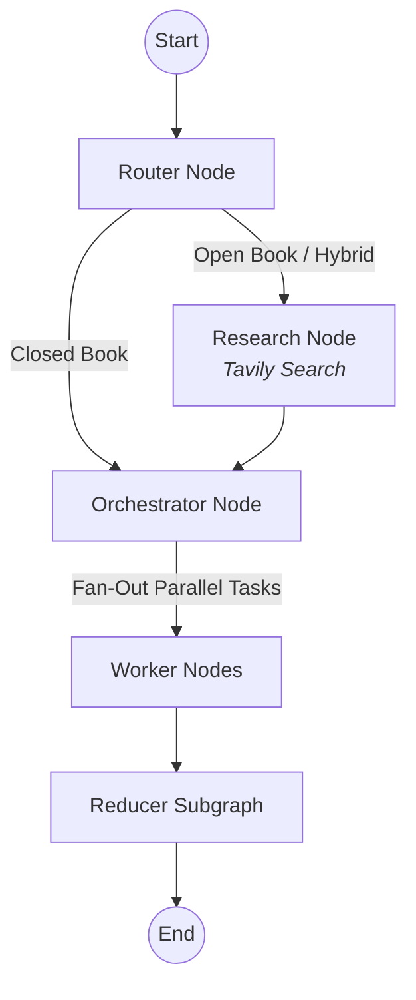

# ✍️ Agentic Blog Writer


An intelligent, multi-agent blog writing application powered by **LangGraph**, **Groq (Llama 3.3 70B)**, and **Streamlit**. 

This system autonomously researches, plans, and writes high-quality technical blog posts. By breaking down the writing process into specialized agentic roles (Router, Researcher, Orchestrator, and Workers), it ensures well-structured, factually grounded, and highly readable content.

---

## 🧠 Architecture & Workflow

The core intelligence is driven by a state machine built with **LangGraph**.



### 1. Router Node
Analyzes the user's topic and decides the research mode:
* **Closed Book**: For evergreen concepts that don't require external research.
* **Hybrid**: For topics that need up-to-date tools or examples.
* **Open Book**: For highly volatile topics like news roundups or recent pricing changes.

### 2. Research Node (Tavily)
If research is needed, this node formulates targeted search queries and uses the **Tavily API** to fetch high-signal web results. It intelligently normalizes dates and limits snippet sizes to stay within token limits.

### 3. Orchestrator Node
Acts as the Senior Technical Editor. It takes the topic and the gathered evidence, and designs a comprehensive **Plan** with 5 to 9 specific sections, setting target word counts, goals, and citation requirements for each.

### 4. Worker Nodes
The fan-out phase. Multiple worker agents run in parallel, each responsible for writing a single section defined by the Orchestrator. They strictly follow formatting constraints and cite evidence URLs to prevent hallucinations.

### 5. Reducer Node
Gathers all the parallel-generated sections, sorts them into the correct order, and merges them into a cohesive, final Markdown document.

---

## ✨ Features
* **Stateless Cloud Deployment**: Fully optimized for Streamlit Community Cloud (no local file saving required).
* **Parallel Execution**: Generates sections concurrently for rapid blog creation.
* **Smart Context Truncation**: Carefully limits payload sizes to avoid Groq Tokens-Per-Minute (TPM) rate limits.
* **Live Streaming UI**: Watch the graph execute in real-time with granular node updates and progress tracking.
* **Markdown Downloads**: Instantly download your generated blog.

---

## 🛠️ Setup & Installation

**1. Clone the repository**
```bash
git clone https://github.com/Harshgup16/blog_llm_streamlit.git
cd blog_llm_streamlit
```

**2. Install dependencies**
```bash
pip install -r requirements.txt
```

**3. Configure Environment Variables**
Create a `.env` file in the root directory and add your API keys:
```ini
GROQ_API_KEY="your_groq_api_key_here"
GROQ_API_KEY_2="your_second_groq_api_key_here"
TAVILY_API_KEY="your_tavily_api_key_here"
```

---

## 💻 Usage

Run the Streamlit frontend:
```bash
streamlit run frontend.py
```

1. Enter your desired **Topic** in the sidebar.
2. Select an **As-of date** for context recency.
3. Click **Generate Blog**.
4. Monitor the live execution logs, review the Plan and Evidence, and download your final Markdown file!
